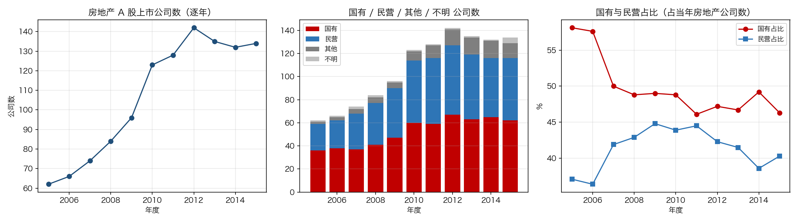
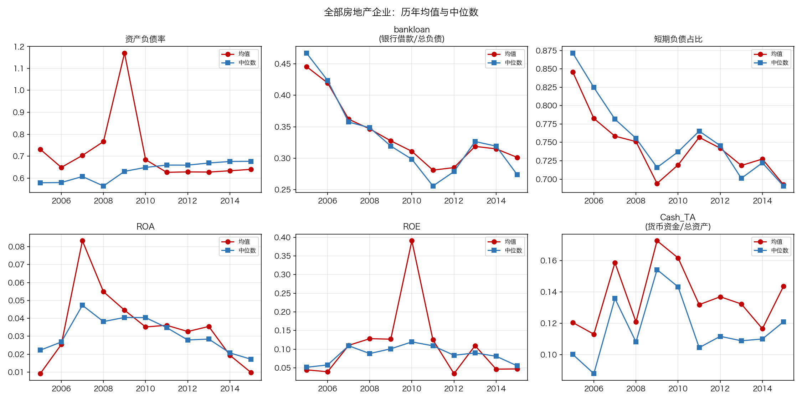
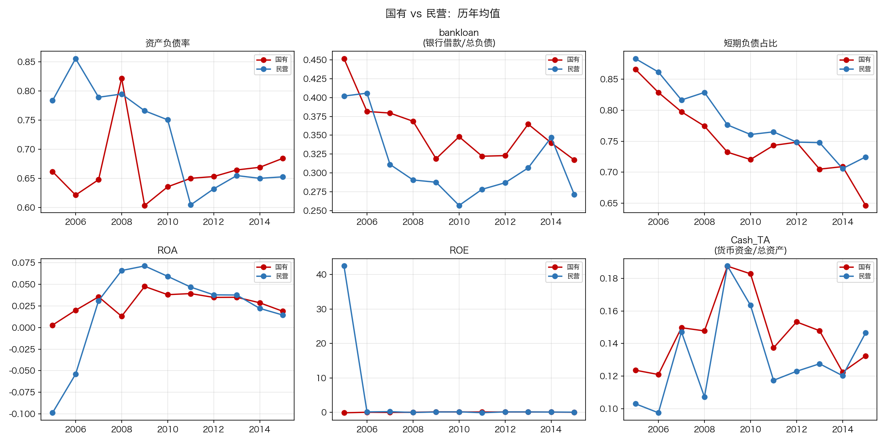
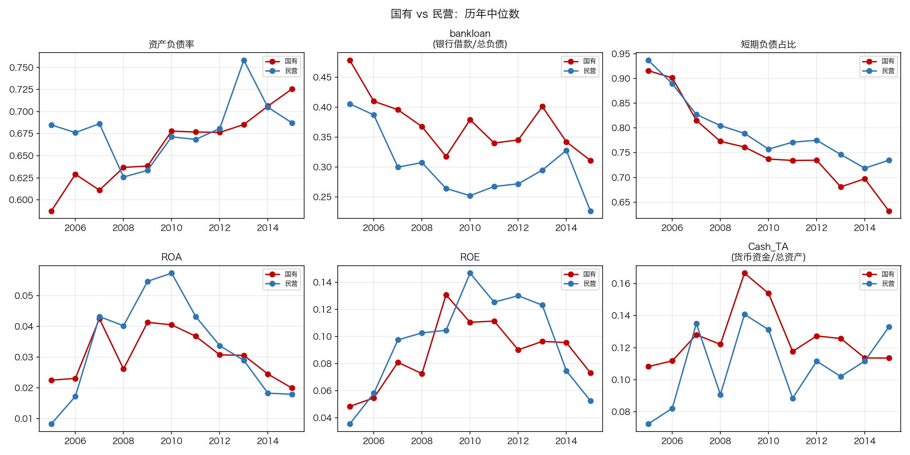

# HW02-2 房地产上市公司财务特征：中期分析报告

> 生成时间：2026-09-25 | 数据：CSMAR 2005—2015 房地产 A 股年度合并报表
> 面板：**1,821 个企业—年度观测 × 170 家公司**
> 本报告对应作业第 3 节「样本与字段 / 数量与产权结构 / 财务指标与时序分析」

---

## 一、作业要求逐条自检

| 作业要求 | 落实方式 | 状态 |
|---|---|---|
| 自行从 CSMAR 下载 2005—2015 年房地产 A 股年度数据 | 本人账号登录导出 5 张表，条件见 `DATA_MANIFEST.md` | ✅ |
| 使用年度合并财务报表 | 仅保留 `Typrep=A`（合并报表）与 `Accper=12-31` 年末记录 | ✅ |
| 按各年年末**上市状态**构建面板 | 并入年度表 `LISTINGSTATE`（正常上市/ST/\*ST/暂停上市），逐年记录 | ✅ |
| 按各年年末**行业**构建 | 逐年 `IndustryCode` 判定房地产，非当前行业覆盖 | ✅ |
| 按各年年末**产权属性**构建 | 逐年 `EquityNature`，1,979 行覆盖 170 家 | ✅ |
| 企业—年度**非平衡面板** | 1,821 观测 ≠ 170×11=1,870，存在上市/退市进出 | ✅ |
| 允许上市、退市、行业或产权变化 | 样本含 ST/暂停上市公司；产权国有→民营个案保留原样 | ✅ |
| 不能只从目前仍上市的公司向前追溯 | 样本=2005—2015 **任一年**为房地产的并集（170 家），含已转出/退市者 | ✅ |
| 不能用当前行业或产权覆盖历史年份 | 行业、产权均逐年取值 | ✅ |
| 分类标准跨年变化说明映射方式 | ≤2011 用 2001 版 `J*`；≥2012 用 2012 版 `K70`（2012 版 `J*` 已变为金融业） | ✅ |
| 记录下载条件、数据表、字段、单位与日期 | `DATA_MANIFEST.md` | ✅ |
| 提供原始字段与分析变量对应表 | `field_mapping.csv`（28 行） | ✅ |

**核查证据**：面板无早于首次上市年份的观测（0 条）；无退市后观测（0 条）；面板公司全部有年度表记录（0 缺失）。

---

## 二、为什么是 170 家而不是你在数据库看到的 123 家

你在 CSMAR 看到的 **123 家**是**静态成员口径**——CSMAR 按「当前仍属于证监会 2001 版 J01」给出的代码池；我做的是**动态并集口径**——「2005—2015 年任一年末被归为房地产」，这才是作业要的（明令禁止只从当前行业追溯）。

| 口径 | 家数 |
|---|---:|
| CSMAR 当前分类代码池（你看到的口径，A 股） | 117 |
| 年度表口径：2005—2015 任一年为房地产（A 股） | **170** |
| 两者交集 | 104 |
| 仅在旧池：2005—2015 从未归入房地产（须剔除） | 13 |
| 仅在年度表：中途转出房地产的老公司（须纳入） | **66** |

**关键的那 66 家**：世纪星源、泛海控股、银亿股份等 1992—2000 年上市的老公司，2005—2010 年是房地产，后来转出。按旧口径它们会被排除，导致 2005 年样本覆盖率只有 62%——正好是作业禁止的错误。

**逐年实际样本量**（行业筛选后）：2005 年 62 家 → 2010 年 **123 家** → 2015 年 134 家。你看到的 123 大概率就是某一年（如 2010 年）的静态计数，与我的逐年序列完全吻合。

各年覆盖率相对全市场房地产公司：**97%—99%**，缺的 5 家全为 B 股（帝贤B、雷伊B、新城B股、凌云B股），本应排除 → A 股实质全覆盖。

---

## 三、数量与产权结构

| 年 | 国有 | 民营 | 其他 | 不明 | 合计 | 国有占比 | 民营占比 |
|---|---:|---:|---:|---:|---:|---:|---:|
| 2005 | 36 | 23 | 2 | 1 | 62 | 58.1% | 37.1% |
| 2010 | 60 | 54 | 8 | 1 | 123 | 48.8% | 43.9% |
| 2015 | 62 | 54 | 13 | 5 | 134 | 46.3% | 40.3% |

国有占比 11 年下降 **11.8 个百分点**，民营稳定在 37%—44%，"其他"（外资为主）从 2 家增至 13 家。

---

## 四、六项财务指标

### 4.1 全样本均值与中位数

### 4.2 国有 vs 民营（均值）

### 4.3 国有 vs 民营（中位数）

### 4.4 年度有效样本量

| 指标 | 2005 | 2008 | 2010 | 2012 | 2015 |
|---|---:|---:|---:|---:|---:|
| 资产负债率 | 62 | 84 | 123 | 142 | 134 |
| ROA / ROE | 62 | 83 | 123 | 142 | 132 |
| bankloan | 62 | 83 | 123 | 142 | 134 |

ROA/ROE 在早期年份样本略少于杠杆类指标，原因是新上市公司缺少上年末分母（结构性缺失，不填补）。

---

## 五、清洗：离群值检查与处理

**检查结论：20 个极端观测，全部来自负权益公司（资不抵债），非技术错误。**

逐年负权益观测数：2005 年 3 个、2008 年 2 个、2009 年 2 个、2010 年 3 个、2013—2014 年 0 个——**占比 1.6%—4.8%**。典型：大洲兴业（7 个年份）、三湘股份（4 个）、中茵股份（3 个）、中润资源 2006 年资产负债率 877（资产 22 万元 vs 负债 1.95 亿元）。

**处理**：全部保留观测并标识（`flag_neg_equity`、`flag_lev_gt1`），不删除、不缩尾；均值与中位数同时呈现，并做剔除前后对比。

### 敏感性：剔除负权益观测前后

| 指标 | 年 | 全样本均值 | 剔除后均值 | 全样本中位数 | 剔除后中位数 | 差异 |
|---|---|---:|---:|---:|---:|---:|
| 资产负债率 | 2005 | 0.7313 | 0.5623 | 0.5787 | 0.5681 | −0.169 |
| 资产负债率 | 2008 | 0.7663 | 0.5501 | 0.5642 | 0.5564 | −0.216 |
| 资产负债率 | 2009 | **1.1700** | 0.5932 | 0.6308 | 0.6259 | **−0.577** |
| 资产负债率 | 2015 | 0.6398 | 0.6361 | 0.6766 | 0.6719 | −0.004 |
| ROE | 2005 | 0.0447 | 0.0388 | 0.0517 | 0.0549 | −0.006 |

**结论**：均值在 2005—2010 年被少数资不抵债公司显著推高（2009 年差距达 0.58），**中位数几乎不受影响**。因此时序解读以中位数为主、均值为辅；2011 年后两类口径差异可忽略，结论稳健。

---

## 六、其他处理决定

| 情形 | 处理 | 数量 |
|---|---|---:|
| 零/负分母 | 返回缺失并计数，不删除观测 | ROA/ROE 12 个、bankloan 1 个 |
| 缺少上年末分母（IPO 首年） | ROA/ROE 返回缺失，不填补、不用更早年份替代 | 12 个观测 |
| B 股 | 按代码前缀 200/900 剔除 | 14 家 |
| 产权缺失（招商积余等） | 归入"不明"，不删公司 | 1—5 家/年 |
| ST / 暂停上市 | 保留（基础库阶段不提前剔除） | 2006 年 38 家，2015 年 2 家 |
